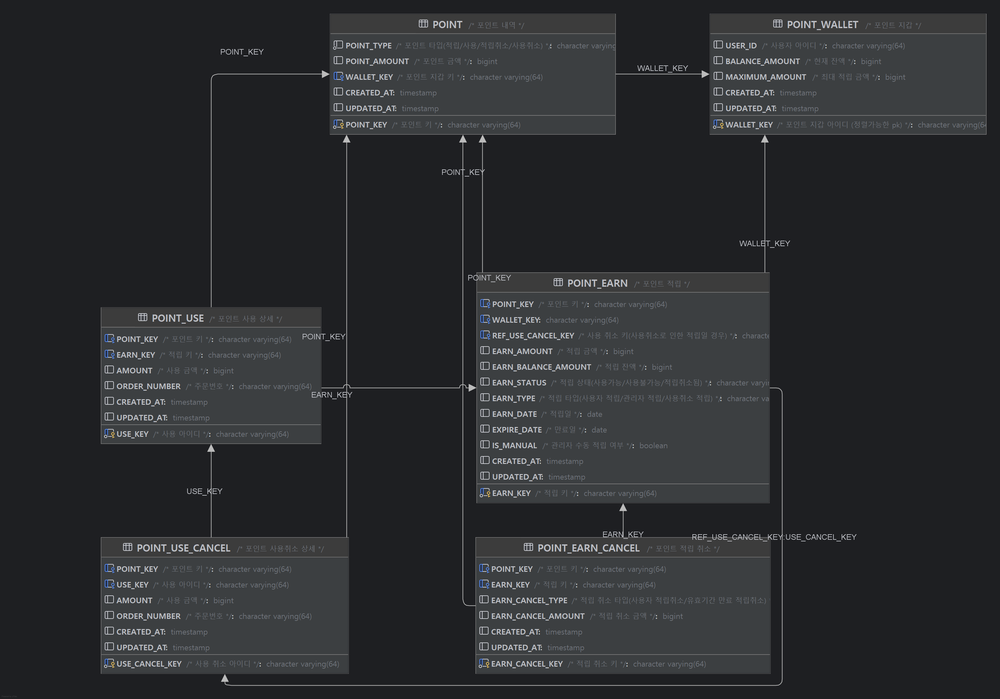

## 1. 설계 철학 및 아키텍처

> **“특정 계층의 수정이 다른 레이어에 미치는 영향을 최소화함으로써, 유지보수성과 확장성을 향상”**

이 아키텍처의 가장 큰 목표는 **유지보수**와 **협업**의 효율성을 높이는 것으로, 각 계층은 명확히 정의된 책임만 가지며, 다른 계층의 내부 구현을 알 필요가 없다. 덕분에 특정 기능의 수정이 필요할 때, 개발자는 해당 책임을 가진 계층의 코드만 집중해서 수정하면 되므로, 이는 다른 기능을 개발하는 동료와의 충돌을 방지하고, 코드 변경으로 인한 예상치 못한 부작용(Side Effect)을 최소화.
  
---  

## 2. 🏛️ 계층별 역할과 책임

### `presentation` (표현 계층)
*   **역할**: 클라이언트와의 API Endpoints. HTTP 요청을 해석하고, 응답을 반환하는 책임.
*   **설계 의도**: 현재는 `application`의 `Command` 객체를 직접 사용하지만, 추후 API 스펙이 복잡해지면 `presentation` 계층만의 독립적인 `RequestDTO`를 사용. 이 DTO를 내부 `Command` 객체로 변환하여 `application` 계층에 전달하는 단계를 추가하면, API의 요청 형식이 변경되더라도 내부 비즈니스 로직은 전혀 영향을 받지 않음으로, **API의 변경과 비즈니스 로직의 변경을 분리**.
```java
// PointController.class
//...
    /**
     * 포인트 적립
     */
    @PostMapping("/earn")
    public ResponseEntity<EarnResult> earnPoints(@Valid @RequestBody EarnCmd request) {
        LocalDate earnDate = LocalDate.now();
        return ResponseEntity.ok(pointCommandService.earn(request, earnDate));
    }
//...
```
### `application` (응용 계층)
*   **역할**: 실제 비즈니스 시나리오를 조율하고 실행하는 곳. `Command` 객체를 받아, 도메인 객체와 인프라스트럭처를 올바른 순서로 호출하여 하나의 완전한 기능을 제공.
*   **설계 의도**: '포인트 적립'이라는 비즈니스 로직은 `PointCommandService` 안에 정의되어 있어, 만약 "포인트 적립 후 사용자에게 이메일을 발송한다"는 기능이 추가된다면, `domain`의 규칙이 아닌 비즈니스 흐름의 변경이므로 `PointCommandService`만 수정. 이러한 수정은 API 명세가 바뀌는 것이 아니므로 **`presentation` 계층에 영향을 주지 않고** 안정적으로 기능을 확장.
```java
// PointCommandService.class
//...
    @Transactional
    public EarnResult earn(EarnCmd earnCmd, LocalDate earnDate){
        // USER LOCK을 통해 트렌젝션중에 다른 요청을 받아 꼬이는 일이 없게 처리
        return userLockRunner.run(earnCmd.userId(), () -> {
            // 1. 포인트 지갑 확인, 적립
            PointWallet wallet = walletRepo.findByUserId(earnCmd.userId())
                    .orElseGet(() -> {
                        String walletId = keyGenerator.newWalletKey();
                        PointWallet newWallet = PointWallet.create(walletId, earnCmd.userId(), policy.defWalletMaximumPoint());
                        return walletRepo.save(newWallet);
                    });

            wallet.earnBalance(earnCmd.pointAmount());
            walletRepo.save(wallet);
            //...
            return EarnResult.success(pointEarn.getPointKey(), wallet.getBalanceAmount(), pointEarn.getExpireDate());
        });
    }
//...
```
### `domain` (도메인 계층)
*   **역할**: 시스템의 가장 핵심적인 비즈니스 규칙을 처리하는 곳. 다른 어떤 계층에도 의존하지 않는 가장 순수한 영역.
*   **설계 의도**: `PointWallet`등 각 도메인들은 자신의 상태나 값을 스스로의 로직(메소드)으로만 변경할 수 있으며, 포인트 적립/사용에 대한 모든 정책과 규칙을 내부에 캡슐화하고 있어, 만약 "포인트는 0원 미만으로 사용할 수 없다"는 규칙이 변경된다면, 오직 `PointWallet` 엔티티의 해당 메소드만 수정. 메소드의 인자가 바뀌지 않는 한, 이 변경은 다른 어떤 계층에도 영향을 주지 않아 **수정의 파급 효과**를 최소화.
```java
// PointWallet.class
//...
    /** 포인트 적립 **/
    public void earnBalance(long point){
        // 적립 최소금액
        if(point < 1){
            throw new BusinessException(ResultCode.WALLET_AMOUNT_ERR);
        }
    
        // 적립 최대금액 초과
        if(this.balanceAmount + point > this.maximumAmount){
            throw new BusinessException(ResultCode.WALLET_AMOUNT_ERR);
        }
    
        this.balanceAmount += point;
    }
//...
```
### `infrastructure` (기반 계층)
*   **역할**: 기술의 세부 사항을 구현하는 곳. 데이터베이스 접근, 메시징, 외부 API 연동, 분산 락 등 "어떻게" 기술을 사용할 것인지에 대한 코드가 위치
*   **설계 의도**: `application` 계층은 `UserLock`이나 `KeyGenerator` 같은 추상적인 **인터페이스**에만 의존. `infrastructure` 계층은 이 인터페이스의 **구현체**(`LocalUserLockRunner` 등)를 제공. 만약 나중에 동시성 제어 방식을 `Redis` 기반의 분산 락으로 변경해야 한다면, 새로운 `RedisUserLockRunner` 구현체를 만들어 Bean으로 등록하기만 하면 되므로, `application` 계층의 코드는 수정할 필요가 없게되어, **기술 교체**를 유연하고 확장석있게 처리 가능
```java
// LocalUserLockRunner.class
//...
    @Override
    public <T> T run(String key, Supplier<T> action) {
        ReentrantLock lock = locks.computeIfAbsent(key, k -> new ReentrantLock());
        lock.lock();
        try { return action.get(); }
        finally { lock.unlock(); }
    }
//...
```
---  

## 3. 🔧 실제 수정 시나리오 예시

이 아키텍처에서는 다음과 같이 특정 계층만 수정하여 요구사항을 처리할 수 있습니다.

*   **요구사항 1: "포인트 적립 시, 메일 알림을 추가."**
    *   **수정 위치**: `application` 계층의 `PointCommandService`.
    *   **설명**: 포인트 적립 로직 마지막에 `MailNotificationService`를 호출하는 코드 한 줄만 추가. `domain`, `presentation` 계층은 전혀 수정할 필요없음.

*   **요구사항 2: "취소로인한 포인트 적립은 적립 취소가 불가능하도록 수정"**
    *   **수정 위치**: `domain` 계층의 `PointEarn` 취소 가능여부를 판단하는 `cancelEarn()` 에 대한 검증로직 추가.
    *   **설명**: 포인트 지갑의 핵심 규칙이므로 `PointEarn`의 검증 로직만 수정. 이 규칙을 사용하는 `application`이나 `presentation` 계층의 코드는 변경되지 않음.

*   **요구사항 3: "서버를 여러 대로 늘려야 해. 동시성 제어 방식의 변경 필요."**
    *   **수정 위치**: `infrastructure` 계층.
    *   **설명**: `Redis`를 이용한 분산 락 구현체(`RedisUserLockRunner`)를 새로 만들고, 기존 `LocalUserLockRunner` 대신 Bean으로 등록(혹은 profile로 조절). `application` 계층의 코드는 `UserLockRunner` 인터페이스에 의존하므로 단 수정할 필요가 없음.

---  
## 4. 엔드포인트

`POST /api/v1/points/earn`  
요청 DTO: `EarnCmd`
```json
{
  "userId": "USER001",
  "pointAmount": 1000,
  "earnType": "EARN_MANUAL",
  "expireDate": "20251231"
}
```
응답 DTO: `EarnResult`
```json
{
  "pointKey": "019a59...0432",
  "balanceAmount": 1000,
  "expireDate": "2025-12-31",
  "resultCode": "SUCCESS"
}
```

### 2) 포인트 사용
`POST /api/v1/points/use`  
요청 DTO: `UseCmd`
```json
{
  "userId": "019a59...0432",
  "useAmount": 800,
  "orderNumber": "A12345"
}
```
응답 DTO: `UseResult`
```json
{
  "pointKey": "019a59...0432",
  "balanceAmount": 200,
  "resultCode": "SUCCESS"
}
```

### 3) 포인트 적립 취소
`POST /api/v1/points/earn/cancel`  
요청 DTO: `EarnCancelCmd`
```json
{
  "userId": "USER001",
  "pointKey": "019a59...0432"
}
```
응답 DTO: `EarnCancelResult`
```json
{
  "pointKey": "019a59...0432",
  "balanceAmount": 0,
  "resultCode": "SUCCESS"
}
```

### 4) 포인트 사용 취소
`POST /api/v1/points/use/cancel`  
요청 DTO: `UseCancelCmd`
```json
{
  "userId": "USER001",
  "pointKey": "019a59...0432",
  "useCancelAmount": 500
}
```
응답 DTO: `UseCancelResult`
```json
{
  "pointKey": "019a59...0432",
  "balanceAmount": 700,
  "resultCode": "SUCCESS"
}
```

### 5) 정책 변경 (동적)
`PUT /api/v1/policy`  
요청 DTO: `PolicyUpdateRequest`
```json
{
  "key": "DEF_EXPIRE_DAYS",
  "value": "365"
}
```
- `LocalPointPolicy`에서는 in-memory 캐시에 반영되고 `reload()`는 no-op
- 키 예시: `MAX_EXPIRE_DAYS`, `DEF_EXPIRE_DAYS`, `MAXIMUM_POINT`, `DEF_WALLET_MAXIMUM_POINT`

---

## 5. 실행
```bash
# (CLI) 일반적인 실행 예시
./gradlew clean bootRun
# 또는 패키징
./gradlew clean build
java -jar build/libs/PointSystem-1.0.0.jar
```
기본 포트: `:8080`

---  
## 6. 테스트
- 요건 시나리오 예시테스트

- 요건 예시테스트


---  
## 7. Entity
- 과제의 요건대로, POINT_KEY라는 메인 KEY가 적립, 적립취소, 사용, 사용취소 의 KEY가 될 수 있게 설계


